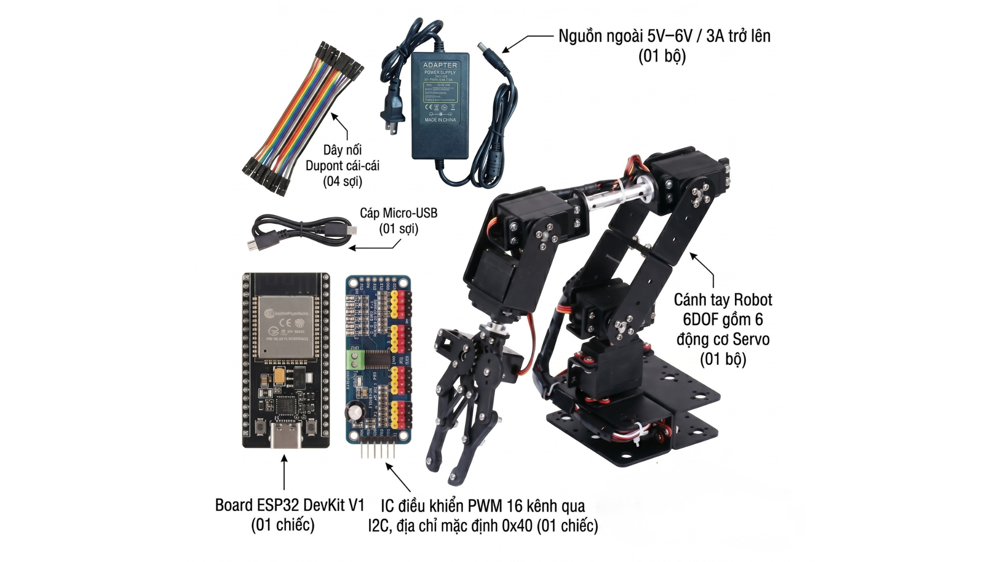
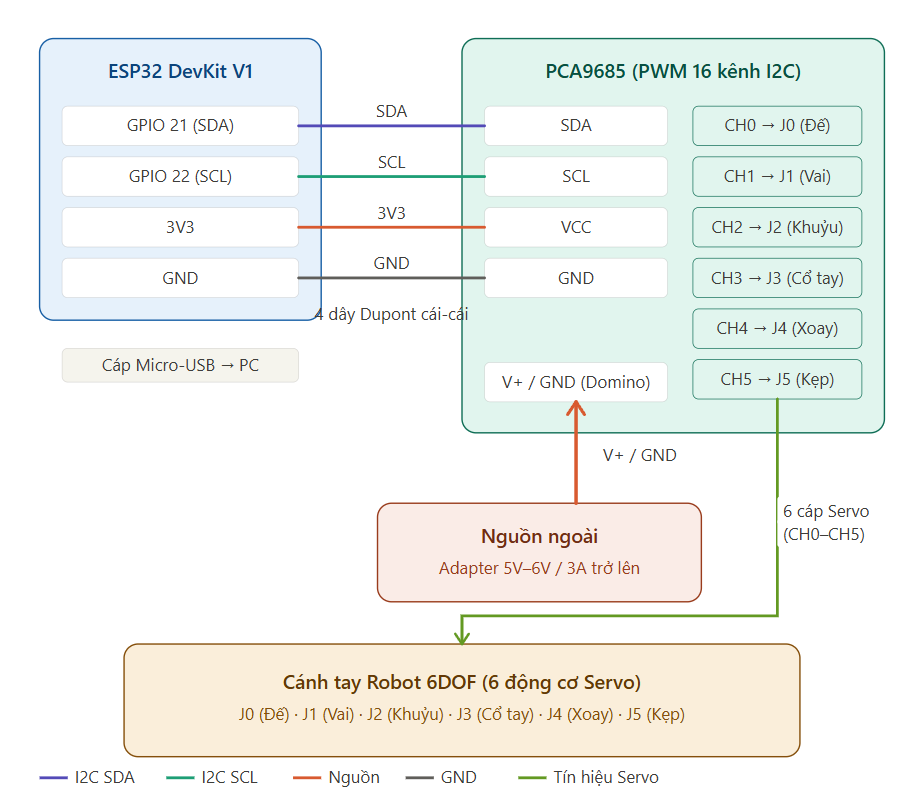

# 🤖 Practical Course: 6DOF Robot Arm with ESP32 & IoT


Welcome to the sample source code repository for the **6DOF Robot Arm Control Practical Course**. This project provides complete C/C++ source code (for the ESP32 microcontroller) and Python (for the computer GUI) from basic to advanced levels, combined with the Internet of Things (Blynk) ecosystem.

---

## 📸 1. Hardware Overview

Below are the hardware components used in the course:

<div align="center">
  
  <p><i>Overall layout of the Robot Arm components</i></p>
</div>

### Detailed List:

| Component | Main Function |
| :--- | :--- |
| **ESP32 DevKit V1** | Central microcontroller, logic processing, Serial reading, and WiFi/Blynk connection. |
| **PCA9685 Module** | I2C communication, outputs 16-channel PWM to control multiple Servos simultaneously. |
| **6DOF Robot Arm** | Aluminum alloy actuator mechanism, includes 6 MG996R/MG995 Servo motors. |
| **6V - 3A Power Adapter** | Provides sufficient current for 6 Servos to operate simultaneously without power drops. |

---

## ⚙️ 2. Wiring Diagram

The system uses the **I2C** protocol to connect the ESP32 and PCA9685:

<div align="center">
  
  <p><i>Detailed diagram of signal pins and power connections</i></p>
</div>

*   **ESP32 `GPIO 21`** $\rightarrow$ PCA9685 `SDA`
*   **ESP32 `GPIO 22`** $\rightarrow$ PCA9685 `SCL`
*   **ESP32 `GND`** $\rightarrow$ PCA9685 `GND`
*   **ESP32 `3V3`** $\rightarrow$ PCA9685 `VCC` (Logic power supply)
*   **External Power 6V/3A** $\rightarrow$ Green Terminal of PCA9685 (Dedicated power for Servos, note **V+ / GND**).

---

## 📂 3. Project Structure

The project contains **two language versions** of the source code, each with a dedicated VS Code workspace:

| Workspace File | Language | Description |
| :--- | :--- | :--- |
| **`RobotArmTutorial-EN.code-workspace`** | 🇬🇧 English | English-translated source code & comments |
| **`RobotArmTutorial-VI.code-workspace`** | 🇻🇳 Vietnamese | Original Vietnamese source code & comments |
| `RobotArmTutorial.code-workspace` | Both | Combined view (both versions) |

Each version is organized as a **Multi-root Workspace** in VS Code, divided into 3 major Labs, each with 3 progressive stages:

```text
ROBOT_ARM_IOT_TUTORIAL_SOURCECODE/
├── RobotArmTutorial-EN.code-workspace   ← [OPEN THIS for English version]
├── RobotArmTutorial-VI.code-workspace   ← [OPEN THIS for Vietnamese version]
├── robot-arm-source-code-en/            ← English Version
│   ├── lab-4/                           ← C++ Programming (PlatformIO)
│   │   ├── stage-1/                     (I2C Scanner)
│   │   ├── stage-2/                     (Basic Servo Control, Serial CLI)
│   │   └── stage-3/                     (Smooth move, simultaneous movement)
│   ├── lab-5/                           ← Python GUI Programming
│   │   ├── stage-1/                     (Basic Serial Communication)
│   │   ├── stage-2/                     (Auto Pick-and-Place)
│   │   └── stage-3/                     (Complete Tkinter GUI)
│   └── lab-6/                           ← IoT Programming (Blynk)
│       ├── stage-1/                     (WiFi connection, 1 joint control)
│       ├── stage-2/                     (6 joints control, state synchronization)
│       └── stage-3/                     (Optimization, Mobile App & Auto Reconnect)
└── robot-arm-source-code/               ← Vietnamese Version (Bản Tiếng Việt)
    ├── bai-thuc-hanh-4/                 ← Lập trình C++ (PlatformIO)
    │   ├── giai-doan-1/                 (I2C Scanner)
    │   ├── giai-doan-2/                 (Điều khiển Servo, Serial CLI)
    │   └── giai-doan-3/                 (Chuyển động mượt, đồng thời)
    ├── bai-thuc-hanh-5/                 ← Lập trình Python GUI
    │   ├── giai-doan-1/                 (Giao tiếp Serial cơ bản)
    │   ├── giai-doan-2/                 (Pick-and-Place tự động)
    │   └── giai-doan-3/                 (GUI Tkinter hoàn chỉnh)
    └── bai-thuc-hanh-6/                 ← Lập trình IoT (Blynk)
        ├── giai-doan-1/                 (Kết nối WiFi, điều khiển 1 khớp)
        └── giai-doan-3/                 (Hoàn thiện, Mobile App & Tự kết nối lại)
```

---

## 🚀 4. Usage Instructions

### Step 1 — Choose your language version

| Version | Workspace to open |
| :--- | :--- |
| 🇬🇧 **English** | `RobotArmTutorial-EN.code-workspace` |
| 🇻🇳 **Vietnamese** | `RobotArmTutorial-VI.code-workspace` |

### For C/C++ Developers (PlatformIO)
1. Install **Visual Studio Code** and the **PlatformIO IDE** Extension.
2. Open VS Code $\rightarrow$ `File` $\rightarrow$ `Open Workspace from File...` $\rightarrow$ Select the workspace file for your preferred language (see table above).
3. In the Status Bar at the bottom, select the environment of the Stage you want to upload.
4. Open the corresponding `platformio.ini` file and change `upload_port = COM9` to your actual COM port.
5. Click the **Upload (right arrow)** button to flash the code to the ESP32.

### For Python GUI
1. Install Python 3.8+.
2. Open the Terminal at the `lab-5/stage-3` directory (English) or `bai-thuc-hanh-5/giai-doan-3` (Vietnamese).
3. Install the required libraries: `pip install -r requirements.txt` (mainly `pyserial`).
4. Run the GUI: `python main.py`


---

## 📜 5. Serial Protocol

The firmware supports plain text-based commands via the Serial port at a baud rate of **115200**, ending with a newline character `\n`.

| Command | Meaning | Syntax | Response |
| :--- | :--- | :--- | :--- |
| **M** | Move 1 joint | `M <joint_id> <angle>` (e.g., `M 0 90`) | `OK` |
| **G** | Get joint angle | `G <joint_id>` | `VAL:<id>:<angle>` |
| **T** | Get total status | `T` | `STA:a0,a1,a2,a3,a4,a5` |
| **H** | Go to Home | `H` (All) or `H <joint_id>` | `OK` |
| **S** | Set speed | `S <joint_id> <speed>` (Speed 1-10) | `OK` |
| **A** | Move simultaneously | `A <a0> <a1> <a2> <a3> <a4> <a5>` | `OK` |
| **W** | Wait for movement | `W` | `DONE` |

---

*This document is specially designed for teaching Embedded Systems & IoT. Good luck to all students!*
